# Production SaaS Infrastructure | AWS + Terraform + GitHub Actions + Docker + ECR + ALB + ASG

---

## Table of Contents

* [Introduction](#introduction)
* [Architecture Overview](#architecture-overview)
* [Prerequisites](#prerequisites)
* [Part 1: Application](#part-1-application)
  * [1. The Express App](#1-the-express-app)
  * [2. The Dockerfile](#2-the-dockerfile)
  * [3. Clone and Explore the Repo](#3-clone-and-explore-the-repo)
* [Part 2: AWS Account Setup](#part-2-aws-account-setup)
  * [1. Install AWS CLI](#1-install-aws-cli)
  * [2. Configure AWS CLI](#2-configure-aws-cli)
  * [3. Install Terraform](#3-install-terraform)
* [Part 3: Pre-Terraform AWS Resources](#part-3-pre-terraform-aws-resources)
  * [1. Create the S3 Backend Bucket](#1-create-the-s3-backend-bucket)
  * [2. Create the DynamoDB Lock Table](#2-create-the-dynamodb-lock-table)
  * [3. Create the ECR Repository](#3-create-the-ecr-repository)
  * [4. Create the IAM Role for EC2](#4-create-the-iam-role-for-ec2)
* [Part 4: Terraform Infrastructure](#part-4-terraform-infrastructure)
  * [1. Understand the Module Structure](#1-understand-the-module-structure)
  * [2. Configure the Backend](#2-configure-the-backend)
  * [3. Update Variables](#3-update-variables)
  * [4. Update user_data.sh](#4-update-user_datash)
  * [5. Deploy the Infrastructure](#5-deploy-the-infrastructure)
  * [6. Verify What Was Created](#6-verify-what-was-created)
* [Part 5: GitHub Actions CI/CD](#part-5-github-actions-cicd)
  * [1. Set Up OIDC Trust Between GitHub and AWS](#1-set-up-oidc-trust-between-github-and-aws)
  * [2. Create the GitHub Actions IAM Role](#2-create-the-github-actions-iam-role)
  * [3. Update Workflow Variables](#3-update-workflow-variables)
  * [4. Add GitHub Secrets](#4-add-github-secrets)
  * [5. Trigger the Pipeline](#5-trigger-the-pipeline)
  * [6. The aws-ci.yaml Pipeline — Stage by Stage](#6-the-aws-ciyaml-pipeline--stage-by-stage)
* [Part 6: First Deployment — Getting the App Running](#part-6-first-deployment--getting-the-app-running)
  * [1. Update user_data.sh With the Image Tag](#1-update-user_datash-with-the-image-tag)
  * [2. Trigger ASG Instance Refresh](#2-trigger-asg-instance-refresh)
  * [3. Verify the Application](#3-verify-the-application)
* [Part 7: Ongoing Deployments](#part-7-ongoing-deployments)
* [Architecture Decisions](#architecture-decisions)
* [Cost Estimate](#cost-estimate)
* [Security Measures](#security-measures)
* [Scaling Strategy](#scaling-strategy)
* [Teardown](#teardown)
* [References](#references)

---

# Introduction

This project provisions production-grade AWS infrastructure for a Dockerized Node.js SaaS web application. Fully defined in Terraform with a clean module structure. The CI/CD pipeline uses GitHub Actions with OIDC — no static credentials stored anywhere. Every pipeline run builds, scans, and pushes a Docker image to ECR tagged with the commit SHA. Deployment uses ASG instance refresh for zero-downtime rolling updates.

**Stack:**

* Node.js Express app, Dockerized
* Amazon VPC — 2 public + 2 private subnets, Multi-AZ
* Application Load Balancer — HTTP, no custom domain required
* EC2 Auto Scaling Group — private subnets, no public IPs
* VPC Endpoints — ECR, S3
* Amazon ECR — image tags tied to commit SHA
* AWS CloudWatch — CPU + unhealthy host alarms
* AWS Budgets — monthly spend cap with email alerts
* GitHub Actions — OIDC-based, no static credentials
* Terraform — fully modular, remote state in S3 + DynamoDB

---

# Architecture Overview

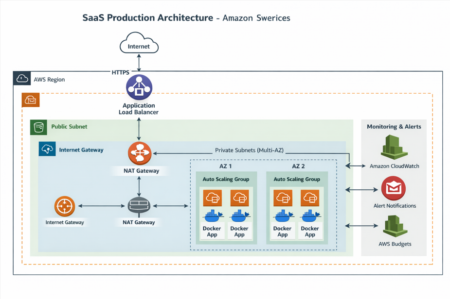

---

# Prerequisites

* AWS account with admin-level IAM permissions
* GitHub account
* Git installed locally
* Docker installed locally

---

# Part 1: Application

## 1. The Express App

Minimal Node.js Express server in `app/server.js` with two routes:

* `GET /` — returns `SaaS Production App Running 🚀`
* `GET /health` — returns HTTP 200 with body `OK`

The `/health` route is what the ALB target group health check hits. If it goes down, the ALB marks the instance unhealthy and the ASG replaces it.

```javascript
const express = require("express");
const app = express();

app.get("/", (req, res) => {
  res.send("SaaS Production App Running 🚀");
});

app.get("/health", (req, res) => {
  res.status(200).send("OK");
});

app.listen(3000, () => {
  console.log("Server running on port 3000");
});
```

## 2. The Dockerfile

```dockerfile
FROM node:22-alpine
WORKDIR /app
COPY package.json .
RUN npm install
COPY server.js .
EXPOSE 3000
CMD ["node", "server.js"]
```

* Uses `node:22-alpine` — minimal attack surface, fewer CVEs for Trivy to flag
* Container listens on port 3000; EC2 maps host port 80 → container port 3000 via `user_data.sh`
* A `.trivyignore` file is included to suppress CVEs in npm's internal packages that are outside your control — documented with reasons, nothing silently ignored

```
├── app/
│   ├── Dockerfile
│   ├── server.js
│   └── package.json
├── terraform/
│   ├── backend.tf
│   ├── main.tf
│   ├── variables.tf
│   ├── terraform.tfvars
│   ├── providers.tf
│   └── modules/
│       ├── vpc/
│       ├── security/
│       ├── alb/
│       ├── compute/
│       ├── monitoring/
│       └── budget/
└── .github/
    └── workflows/
        ├── aws-ci.yaml      ← main pipeline (ECR)
        └── docker-ci.yaml   ← alternate pipeline (Docker Hub)
```

---

# Part 2: AWS Account Setup

## 1. Install AWS CLI

On Linux:

```bash
curl "https://awscli.amazonaws.com/awscli-exe-linux-x86_64.zip" -o awscliv2.zip
unzip awscliv2.zip
sudo ./aws/install
aws --version
```

On macOS:

```bash
brew install awscli
aws --version
```

On Windows: download the installer from https://aws.amazon.com/cli/

## 2. Configure AWS CLI

```bash
aws configure
```

Enter when prompted:

```
AWS Access Key ID:     <your-access-key-id>
AWS Secret Access Key: <your-secret-access-key>
Default region name:   us-east-1
Default output format: json
```

Verify:

```bash
aws sts get-caller-identity
```

> Note your 12-digit Account ID from the output — you'll need it in several places.

## 3. Install Terraform

> Terraform runs on your local machine. `terraform apply` calls the AWS API directly using your configured credentials.

On Linux:

```bash
curl -fsSL https://apt.releases.hashicorp.com/gpg | sudo apt-key add -
sudo apt-add-repository "deb [arch=amd64] https://apt.releases.hashicorp.com $(lsb_release -cs) main"
sudo apt update && sudo apt install -y terraform
terraform -version
```

On macOS:

```bash
brew tap hashicorp/tap
brew install hashicorp/tap/terraform
terraform -version
```

On Windows: download from https://developer.hashicorp.com/terraform/install and add to PATH.

---

# Part 3: Pre-Terraform AWS Resources

These must exist before running `terraform apply`. Terraform references them but does not create them.

## 1. Create the S3 Backend Bucket

Terraform state lives here — shared, versioned, not lost if your local machine dies.

1. Go to **S3** → **Create bucket**
2. **Bucket name:** use a unique name, e.g. `saas-terraform-state-<your-account-id>`
3. **Region:** `us-east-1`
4. **Block all public access:** leave checked (default)
5. **Bucket Versioning:** Enable
6. **Default encryption:** SSE-S3
7. Click **Create bucket**

Note the exact bucket name — you'll put it in `backend.tf`.

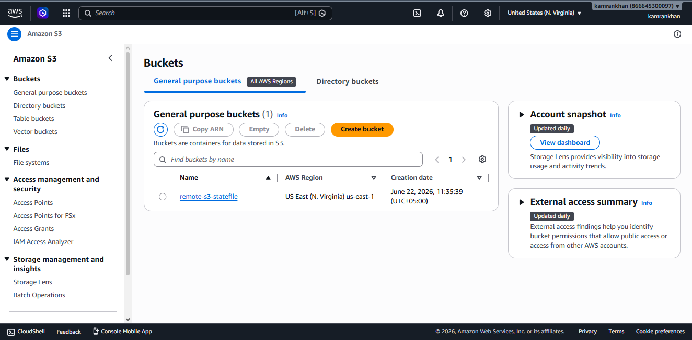

## 2. Create the DynamoDB Lock Table

Prevents two concurrent `terraform apply` runs from corrupting the state file.

1. Go to **DynamoDB** → **Tables** → **Create table**
2. **Table name:** `remote-infra-statefile`
3. **Partition key:** `LockID` (String)
4. **Capacity mode:** On-demand
5. Click **Create table** — wait for status to show **Active**

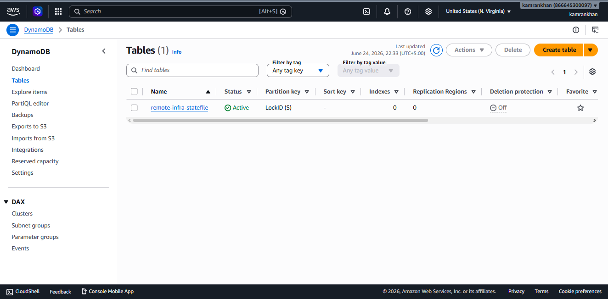

## 3. Create the ECR Repository

1. Go to **Amazon ECR** → **Repositories** → **Create repository**
2. **Repository name:** `saas-app`
3. **Image tag mutability:** Immutable
4. Click **Create repository**

Note the Repository URI — it looks like `123456789012.dkr.ecr.us-east-1.amazonaws.com/saas-app`.

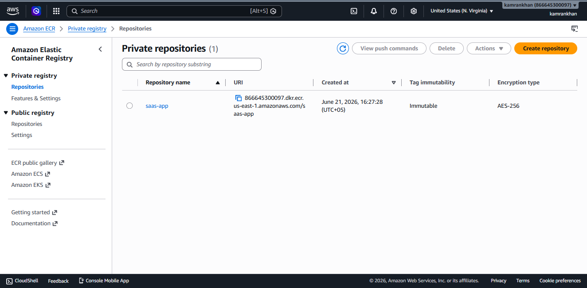

## 4. Create the IAM Role for EC2

EC2 instances use this role to pull images from ECR without static credentials.

1. Go to **IAM** → **Roles** → **Create role**
2. **Trusted entity:** AWS service → EC2
3. **Attach policy:** `AmazonEC2ContainerRegistryReadOnly`
4. **Role name:** `ec2-saas-prod-instance-profile`

> Name it exactly `ec2-saas-prod-instance-profile` — this matches the value in `terraform/main.tf`. The console automatically creates a matching instance profile with the same name.

---

# Part 4: Terraform Infrastructure

## 1. Understand the Module Structure

All modules are wired together in `terraform/main.tf`.

**`modules/vpc/`**
- VPC `10.0.0.0/16` with DNS support and DNS hostnames enabled (required for VPC endpoints)
- Internet Gateway, 2 public subnets + 2 private subnets across `us-east-1a` and `us-east-1b`
- Public subnets route to IGW; private subnets have no internet route
- VPC endpoints: `ecr.api` (Interface), `ecr.dkr` (Interface), `s3` (Gateway) — private instances reach ECR without a NAT Gateway

**`modules/security/`**
- ALB SG: port 80 inbound from anywhere, full egress
- EC2 SG: port 80 inbound from ALB SG only, full egress

**`modules/alb/`**
- Public-facing ALB on port 80 (HTTP)
- Target group with `/health` health check (interval 60s, timeout 30s, threshold 2)

**`modules/compute/`**
- Launch template: `t3.micro`, Amazon Linux 2, 8GB encrypted EBS, IAM instance profile
- ASG: min 2, desired 2, max 4 instances in private subnets

**`modules/monitoring/`**
- SNS topic with email subscription
- CloudWatch alarm: ASG CPU > 70%
- CloudWatch alarm: ALB unhealthy host count > 0

**`modules/budget/`**
- $100/month budget, email alert at 80% ($80)

## 2. Configure the Backend

Open `terraform/backend.tf` and update the bucket name:

```hcl
terraform {
  backend "s3" {
    bucket         = "<your-bucket-name>"
    key            = "saas-app/terraform.tfstate"
    region         = "us-east-1"
    dynamodb_table = "remote-infra-statefile"
    encrypt        = true
  }
}
```

## 3. Update Variables

Open `terraform/terraform.tfvars` and set your emails:

```hcl
sns_email    = "your-email@example.com"
budget_email = "your-email@example.com"
```

**AMI ID check** — `terraform/main.tf` uses `ami-0c02fb55956c7d316` (Amazon Linux 2, `us-east-1`). AMI IDs are periodically replaced. Before deploying, verify it's still valid:

EC2 console → **AMIs** → **Public images** → filter Owner alias `amazon`, Platform `Amazon Linux` → confirm the ID is in the list. If not, grab the latest Amazon Linux 2 entry and update `ami` in `terraform/main.tf`.

> Pick Amazon Linux 2, not Amazon Linux 2023 — `user_data.sh` uses `amazon-linux-extras` which only exists on AL2.

## 4. Update user_data.sh

> Before `terraform apply`, you need an image in ECR. Complete Part 5 first to run the pipeline and push an image, then come back here.

Open `terraform/modules/compute/user_data.sh` and replace `<your-account-id>` and `<commit-sha>` with your actual values:

```bash
#!/bin/bash
yum update -y
amazon-linux-extras install docker -y
systemctl start docker
systemctl enable docker
aws ecr get-login-password --region us-east-1 | docker login --username AWS --password-stdin <your-account-id>.dkr.ecr.us-east-1.amazonaws.com
docker pull <your-account-id>.dkr.ecr.us-east-1.amazonaws.com/saas-app:<commit-sha>
docker run -d -p 80:3000 --restart unless-stopped <your-account-id>.dkr.ecr.us-east-1.amazonaws.com/saas-app:<commit-sha>
```

The `aws ecr get-login-password` command works because the IAM instance profile is attached — no hardcoded credentials needed.

## 5. Deploy the Infrastructure

```bash
cd terraform
terraform init
terraform plan
terraform apply
```

- `terraform init` — downloads providers, configures S3 backend
- `terraform plan` — preview: VPC, subnets, IGW, VPC endpoints, security groups, ALB, ASG, CloudWatch alarms, SNS, budget
- `terraform apply` — type `yes` to confirm; takes 3–5 minutes

## 6. Verify What Was Created

**ALB:** EC2 console → Load Balancers → `prod-alb` → State: **Active**

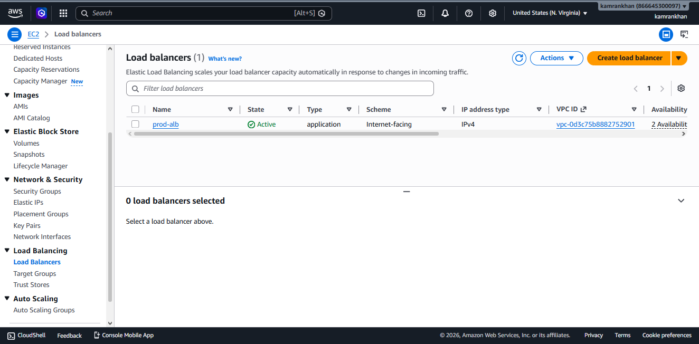

**ASG:** EC2 console → Auto Scaling Groups → 2/2 Healthy

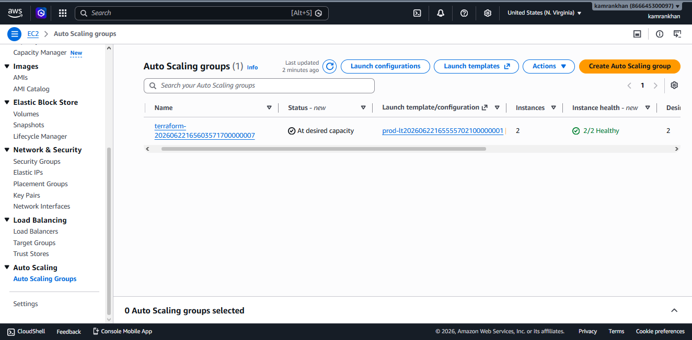

**EC2 Instances:** 2 running, one in each AZ, 3/3 status checks passed

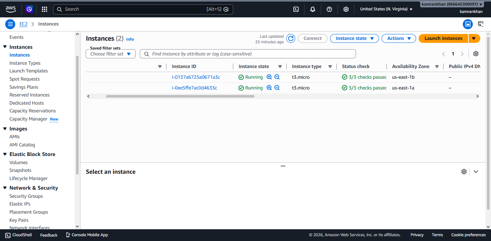

**Target Group:** 2 healthy targets

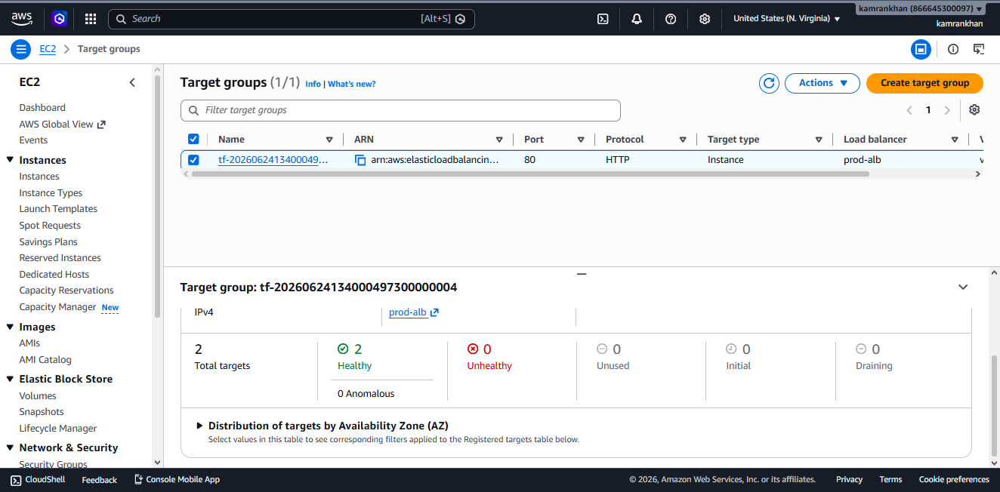

**SNS:** check your inbox for an AWS confirmation email → click **Confirm subscription** (alarms won't fire until confirmed)

---

# Part 5: GitHub Actions CI/CD

The pipeline in `.github/workflows/aws-ci.yaml` uses OIDC — GitHub proves its identity to AWS, no stored secrets needed.

## 1. Set Up OIDC Trust Between GitHub and AWS

1. **IAM** → **Identity providers** → **Add provider**
2. Provider type: **OpenID Connect**
3. Provider URL: `https://token.actions.githubusercontent.com`
4. Click **Get thumbprint**
5. Audience: `sts.amazonaws.com`
6. Click **Add provider**

## 2. Create the GitHub Actions IAM Role

Create `github-actions-trust.json` — replace the placeholders with your values:

```json
{
  "Version": "2012-10-17",
  "Statement": [{
    "Effect": "Allow",
    "Principal": {
      "Federated": "arn:aws:iam::<your-account-id>:oidc-provider/token.actions.githubusercontent.com"
    },
    "Action": "sts:AssumeRoleWithWebIdentity",
    "Condition": {
      "StringEquals": {
        "token.actions.githubusercontent.com:aud": "sts.amazonaws.com"
      },
      "StringLike": {
        "token.actions.githubusercontent.com:sub": "repo:<your-github-username>/<your-repo-name>:*"
      }
    }
  }]
}
```

```bash
aws iam create-role \
  --role-name github-actions-role \
  --assume-role-policy-document file://github-actions-trust.json

aws iam attach-role-policy \
  --role-name github-actions-role \
  --policy-arn arn:aws:iam::aws:policy/AmazonEC2ContainerRegistryPowerUser
```

## 3. Update Workflow Variables

Open `.github/workflows/aws-ci.yaml` and replace the placeholders:

```yaml
env:
  AWS_REGION: us-east-1
  AWS_ACCOUNT_ID: <your-account-id>
  ECR_REPOSITORY: saas-app
  IMAGE_TAG: ${{ github.sha }}
  LAUNCH_TEMPLATE_ID: <your-lt-id>    # EC2 console → Launch Templates → name prefix prod-lt
  ASG_NAME: prod-asg
```

Also update the role ARN in the `push` job:

```yaml
role-to-assume: arn:aws:iam::<your-account-id>:role/github-actions-role
```

## 4. Add GitHub Secrets

The `aws-ci.yaml` pipeline needs no AWS secrets — OIDC handles authentication. Secrets are only needed if using the Docker Hub alternate pipeline (`docker-ci.yaml`):

**GitHub → repo → Settings → Secrets and variables → Actions → New repository secret**

| Secret | Value |
|---|---|
| `DOCKERHUB_USERNAME` | your Docker Hub username |
| `DOCKERHUB_TOKEN` | your Docker Hub access token |

## 5. Trigger the Pipeline

Both workflows use `workflow_dispatch` — they don't run on push automatically.

**GitHub → repo → Actions → Production CI/CD Pipeline → Run workflow → Run workflow**

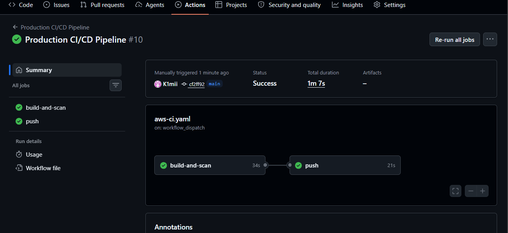

To enable auto-trigger on push, add to `aws-ci.yaml`:

```yaml
on:
  push:
    branches:
      - main
  workflow_dispatch: {}
```

## 6. The aws-ci.yaml Pipeline — Stage by Stage

**Job 1: `build-and-scan`**

- Builds the Docker image locally
- Runs Trivy scan — if any CRITICAL or HIGH CVE is found, exit code 1, pipeline stops, image never reaches ECR
- `.trivyignore` suppresses documented CVEs in npm internals

**Job 2: `push`** (runs only if `build-and-scan` passes)

- Assumes `github-actions-role` via OIDC — no stored credentials
- Logs into ECR
- Rebuilds the image, tags with commit SHA, pushes to ECR

After a successful push, your image appears in ECR tagged with the commit SHA:

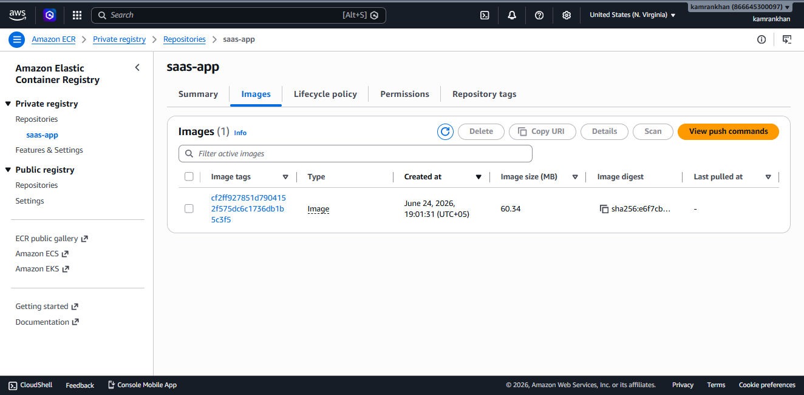

---

# Part 6: First Deployment — Getting the App Running

## 1. Update user_data.sh With the Image Tag

1. Go to **ECR console → Repositories → saas-app → Images**
2. Copy the image tag (commit SHA) of the image just pushed
3. Open `terraform/modules/compute/user_data.sh` — update `<your-account-id>` and `<commit-sha>`
4. Run `terraform apply` — creates a new launch template version with the updated script

## 2. Trigger ASG Instance Refresh

The ASG won't replace running instances automatically when the launch template changes. Trigger it manually:

1. **EC2 → Auto Scaling Groups → prod-asg → Instance refresh tab**
2. Click **Start instance refresh**
3. **Minimum healthy percentage:** 50%
4. Click **Start**

With 2 instances and 50% minimum healthy, one instance is replaced at a time. Zero downtime.

What happens:

```
ASG terminates one old instance
       ↓
Launches replacement using latest launch template
       ↓
user_data.sh runs → ECR login → docker pull → docker run
       ↓
ALB hits /health → 200 OK → instance marked healthy
       ↓
Repeats for second instance
```

## 3. Verify the Application

Get the ALB DNS name from **EC2 → Load Balancers → prod-alb → DNS name**, then open it in a browser:

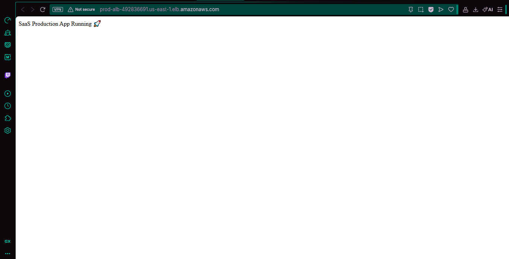

```
http://<alb-dns-name>/        → SaaS Production App Running 🚀
http://<alb-dns-name>/health  → OK
```

---

# Part 7: Ongoing Deployments

For each code change:

1. Run the pipeline: **GitHub → Actions → Production CI/CD Pipeline → Run workflow**
2. Pipeline pushes a new image to ECR with the new commit SHA
3. Update `terraform/modules/compute/user_data.sh` with the new commit SHA
4. Run `terraform apply` — new launch template version created
5. Trigger ASG instance refresh (Part 6 Step 2)

---

# Architecture Decisions

**Multi-AZ** — VPC spans `us-east-1a` and `us-east-1b`. ASG distributes instances across both so one AZ failure doesn't take down the app.

**Private EC2** — Instances have no public IPs. The only path in is through the ALB. Eliminates direct-to-instance attack surface.

**VPC Endpoints instead of NAT Gateway** — Private instances reach ECR through Interface endpoints (`ecr.api`, `ecr.dkr`) and an S3 Gateway endpoint. Saves ~$25/month vs NAT Gateway and keeps traffic on the AWS private network.

**HTTP-only ALB** — No custom domain in this setup. For production, add a domain + ACM certificate, switch the listener to HTTPS on port 443, and redirect port 80.

**Commit SHA image tags + immutable ECR** — Every image is permanently tied to the exact commit that produced it. No tag can be overwritten.

**OIDC for GitHub Actions** — No AWS keys stored in GitHub. If the repo is compromised, there are no long-lived credentials to steal.

**Remote Terraform state** — State in S3 (versioned, encrypted). DynamoDB lock prevents concurrent applies from corrupting it.

**Trivy security gate** — Image never reaches ECR if CRITICAL or HIGH CVEs are found. CVEs in npm internals that have no fix are documented in `.trivyignore`.

---

# Cost Estimate

| Resource | Monthly Cost |
|---|---|
| 2× t3.micro EC2 | ~$17 |
| Application Load Balancer | ~$22 |
| VPC Endpoints for ECR (2× interface) | ~$7 |
| EBS Volumes (2× 8GB encrypted) | ~$2 |
| CloudWatch Alarms | ~$5 |
| ECR Storage | ~$1 |
| Data Transfer | ~$5 |
| **Total** | **~$59/month** |

Budget alert fires at $80 (80% of $100 limit). Run `terraform destroy` when done to stop all charges.

**Cost optimisation:**
- Switch to `t4g.micro` (Graviton) — ~20% cheaper
- Savings Plans for long-term use
- Schedule ASG scale-down during off-hours


# Scaling Strategy

ASG configuration:
- **Min:** 2 (Multi-AZ coverage at zero traffic)
- **Desired:** 2
- **Max:** 4

To add CPU-based auto scaling: EC2 console → Auto Scaling Groups → prod-asg → Automatic scaling tab → Create dynamic scaling policy → policy type Target tracking → metric Average CPU utilization → target value 60 → Create.

The existing CloudWatch alarm at CPU > 70% sends an SNS email alert — the scaling policy above adds the actual scale-out action.

Instance refresh uses 50% minimum healthy — with 2 instances, one always serves traffic during a deployment.

---

# Teardown

```bash
cd terraform
terraform destroy
```

Type `yes`. Removes everything Terraform created.

Manually delete the following (created outside Terraform):

**1. ECR repository**

ECR console → Repositories → select saas-app → Delete → type delete to confirm.

**2. S3 state bucket**

S3 console → click into the bucket → Empty → type permanently delete → Empty. Then select the bucket → Delete → type bucket name → Delete bucket.

**3. DynamoDB lock table**

DynamoDB console → Tables → select your table → Delete → confirm.

**4. EC2 IAM role**

IAM → Roles → search `ec2-saas-prod-instance-profile` → Delete

**5. GitHub Actions IAM role**

IAM console → Roles → search github-actions-role → select → Delete → confirm.

---

# References

**Terraform**
* AWS Provider: https://registry.terraform.io/providers/hashicorp/aws/latest/docs
* S3 Backend: https://developer.hashicorp.com/terraform/language/settings/backends/s3
* ASG Instance Refresh: https://registry.terraform.io/providers/hashicorp/aws/latest/docs/resources/autoscaling_group

**GitHub Actions**
* OIDC with AWS: https://docs.github.com/en/actions/security-for-github-actions/security-hardening-your-deployments/configuring-openid-connect-in-amazon-web-services
* configure-aws-credentials: https://github.com/aws-actions/configure-aws-credentials
* amazon-ecr-login: https://github.com/aws-actions/amazon-ecr-login

**Amazon ECR**
* Authentication: https://docs.aws.amazon.com/AmazonECR/latest/userguide/ECR_Authorization.html
* Image tag immutability: https://docs.aws.amazon.com/AmazonECR/latest/userguide/image-tag-mutability.html
* VPC endpoints: https://docs.aws.amazon.com/AmazonECR/latest/userguide/vpc-endpoints.html

**Trivy**
* GitHub Action: https://github.com/aquasecurity/trivy-action
* Ignore files: https://trivy.dev/latest/docs/configuration/filtering/

**AWS ALB**
* Health checks: https://docs.aws.amazon.com/elasticloadbalancing/latest/application/target-group-health-checks.html

**AWS Budgets**
* Creating budgets: https://docs.aws.amazon.com/cost-management/latest/userguide/budgets-create.html
